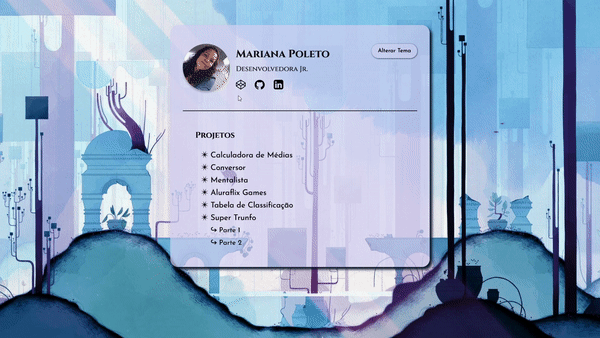

# Portifólio

Repositório dos projetos realizados durante a Imersão_dev Alura

## 🤿 Imersão_dev Alura

Em setembro de 2022 participei do evento da Alura, Imersão _dev, que foi focado em HTML, CSS e, principalmente, Javascript (vanilla).  
Durante a imersão os instrutores (Paulo Silveira, Rafaella Ballerini e Guilherme Lima) apresentavam os fundamentos dos projetos e deixavam desafios para o alunos aprofundarem os conceitos dados em aula.  
Como as aulas, em sua maioria, foram focadas em Javascript a parte da estilização ficou a critério dos alunos.

> Os projetos foram desenvolvidos no *[CodePen](https://codepen.io/)*. 

**Agradecimento**

Foi uma experiência incrível da qual pude vivenciar, reforçar o que já sabia e aprender muito mais.  
Adorei a ideia de desenvolver os projetos no CodePen, poder conhecer uma nova plataforma e ver as diversas versões incríveis que um mesmo projeto pode ter nas mãos de outras pessoas. 
Quero deixar aqui meus agradecimentos a toda a equipe da Alura que disponibilizaram essa imersão 👏👏👏  
😄  

## 👩‍💻 Certificard

**Nona e décima aulas da Imersão Dev_ Alura**

O certificard foi o projeto final pelo qual é possível acessar os demais projetos realizados durante o evento.  
- Neste projeto os instrutores mostraram o Figma, conceitos de HTML/CSS e como alternar entre os modos light e dark com o Javascript.
- Além disso, mostraram como fazer o deploy no GitHub.

-----------
A Pen created on CodePen.io. Original URL: [https://codepen.io/mpoleto/pen/PoepzBQ](https://codepen.io/mpoleto/pen/PoepzBQ).

