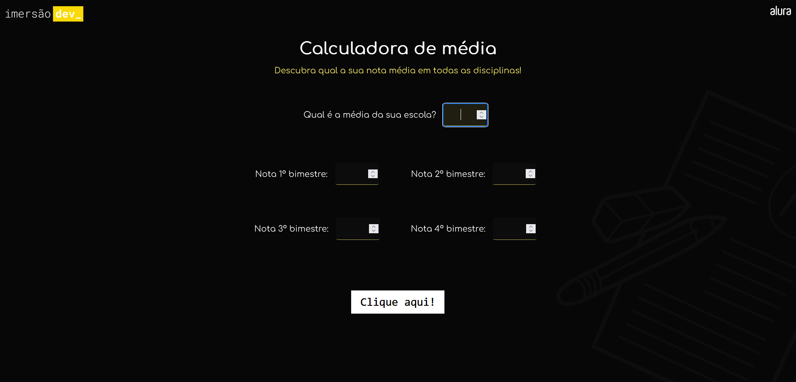

# Calculadora de média

**Primeira aula da Imersão Dev_ Alura**

Projeto para criar uma calculadora de média de notas.

## Conteúdo da aula:

- Entender as diferenças entre HTML, CSS e JavaScript;
- Variáveis, manipulação dos valores armazenados e a memória do computador;
- Tipos de variáveis, como texto e inteiro;
- Fixando a quantidade de casas decimais com a função `toFixed()`;

## Desafios propostos:

1. Colocar a conta inteira da média em apenas uma linha.

2. Mostrar se a aluna ou aluno foi aprovada(o) ou não:
   - escrevi uma função que verifica se a média final do aluno é maior ou igual que a média da escola.

3. Imprimir na própria página o resultado, ao invés do console: 
    - adicionei um formulário no HTML com um campo para adicionar a média escolar, usada de base para comparação, e mais quatro campos para adicionar a nota de cada bimestre para calcular a média e um botão, que aciona o evento criado com 'addEventListener' no JavaScript. Esse evento chama a função criada para calcular a média e manipular o html e o css para mostrar o resultado.

4. Alterar o fundo da tela da maneira que achar mais legal:
    - alterei a estilização da página com css, troquei a imagem de fundo e a fonte.

5. Criar um conversor de temperaturas entre Fahrenheit e Celsius:
    - criei uma variável para armazenar a temperatura em fahrenheit e outra variável que recebe a operação matemática que faz a conversão da temperatura. Adicionei o método parseFloat() para caso a variável fahrenheit receba o valor escrito com a unidade de medida. E para imprimir o resultado no console, adicionei o método toFixed() para mostrar o resultado só com uma casa decimal.

--------
A Pen created on CodePen.io. Original URL: [https://codepen.io/mpoleto/pen/YzLXqWd](https://codepen.io/mpoleto/pen/YzLXqWd).