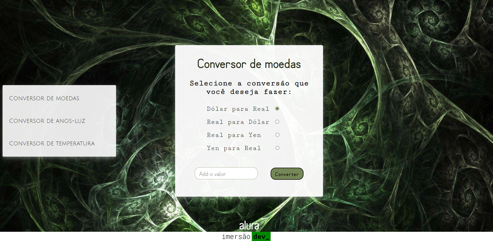

# Conversor de moedas

**Segunda aula da Imersão Dev_ Alura**

Projeto base: criar um conversor de moedas para saber o valor em reais de um produto que está com o valor em dólares.

## Conteúdo da aula:

- Interagir com usuário para receber os preços a serem convertidos;
- Criar a lógica para saber como converter;
- Utilizar funções que interagem com a tela;
- Exibir o resultado na tela com `innerHTML`;

## Desafios propostos:

1. Conversor para outras moedas:
    - Dólar para real / Real para dólar.
    - Yen para real / Real para yen.
    - Usei no HTML o input do tipo *radio* para adicionar as opções de conversão.
    - No javascript usei o *switch case* para verificar qual opção foi selecionada e chamar a função correta para fazer o cálculo da conversão desejada e exibir o resultado na página.  

2. Conversor de quilômetros para Anos-luz: 
    - Utilizei o input do tipo *radio* para selecionar se a conversão é de km para Anos-luz ou ao contrário.
    - No Javascript escrevi uma função que verifica qual é a conversão selecionada, faz o cálculo necessário e exibe o resultado na página.  

3. Conversor de temperaturas entre Fahrenheit, Kelvin e Celsius:
    - Adicionei duas tags *select* com as unidades de temperatura, a primeira tag é para selecionar qual é a unidade inicial e a segunda é para qual unidade será feita a conversão.
    - No Javascript escrevi uma função que utiliza *switch case* para verificar qual é a unidade inicial da temperatura, a partir disso, chama a função que converte da unidade inicial para unidade de temperatura escolhida e exibe o resultado.  

## Além dos desafios:

- Para receber o valor a ser convertido usei o input do tipo *number*.
- Para alternar entre os tipos de conversor, criei um menu no HTML para selecionar o conversor. No javascript, quando um conversor é selecionado, uma função é chamada para manipular a propriedade *display* do CSS, na conversão seleciona a propriedade fica como *display: block*, enquanto as demais ficam como *display: none*.

  

----------
A Pen created on CodePen.io. Original URL: [https://codepen.io/mpoleto/pen/ZEobYQN](https://codepen.io/mpoleto/pen/ZEobYQN).
