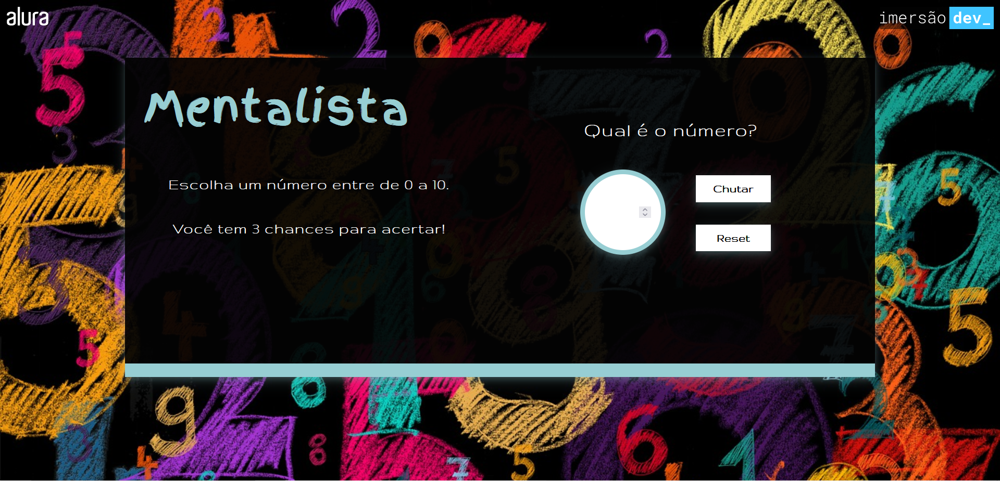

# Mentalista

**Terceira aula da Imersão Dev_ Alura**

Jogo da adivinhação onde o programa escolhe um número aleatório e nós tentamos acertar.

## Conteúdo da aula:

- Fazer testes utilizando `console.log()`;
- Criar a lógica por trás do "chute" com `if`, `else if` e `else`;
- Utilizar a função `Math.random()` do Javascript para gerar números aleatórios;

## Desafios propostos:

1. Adicionar um número de tentativas para a pessoa tentar acertar e imprimir a resposta no final:
    - Escrevi a função em Javascript que verifica se o número chutado é igual ao número escolhido pelo programa, junto com um contador para que depois de 3 tentativas o programa não desabilite o campo de entrada do valor e informe qual era o número correto.
2. Quando a pessoa errar, deixar na mensagem se o número chutado é maior ou menor que o número secreto:
    - escrevi uma função que compara o número chutado com o número certo e retorna se o número certo é maior ou menor que o número que foi chutado.

## Além dos desafios:

- Adicionei um botão **reset** para poder zerar o jogo e começar novamente com um novo número para acertar.

-----------
A Pen created on CodePen.io. Original URL: [https://codepen.io/mpoleto/pen/wvjMKPz](https://codepen.io/mpoleto/pen/wvjMKPz).

