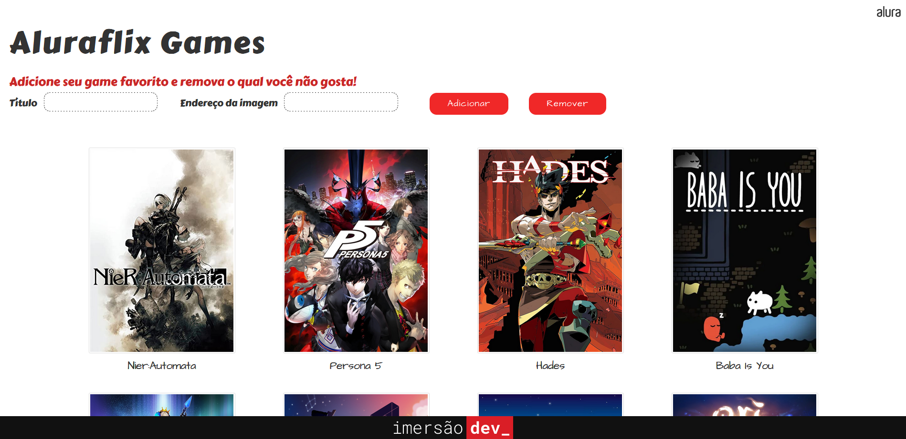

# AluraFlix

**Quarta e quinta aulas da Imersão Dev_ Alura**

Projeto com foco em criação e manipulação de arrays.
Criar uma página que exibe imagens (postêres), *Aluraflix*, o endereço das imagens são adicionadas em uma array e as imagens são adicionadas à página por um campo de input.

## Conteúdo da aula:

- Criar uma primeira array de filmes usando a sintaxe `[]`;
- Utilizar o método `filmes.push("Nome Do Filme")` para inserir um novo elemento na lista (ou seja, um novo filme na array);
- Utilizar a instrução `for` para *iterar*, ou seja, percorrer todos os elementos de uma array;
- Criar uma array com imagens de pôsteres de alguns filmes que gostamos;
- Montar a lógica do programa que vai *iterar* esta array de filmes e exibir cada um deles na tela, integrando o `for` do Javascript com `document.write()`.
- Sintaxe e criação de funções no JavaScript;
- Integrando funções criadas no JavaScript com o HTML que está sendo exibido na tela;
- Condicionando a execução (ou "chamada") de uma função a um clique em um botão na tela;
- Usando o JavaScript para acessar o que está sendo exibido na tela e pegar valores digitados pelo usuário com `getElementById()` e `.value`;
- Passar informações que as funções precisam para funcionar, através dos *parâmetros*;
- Utilizar o `.endsWith()` para verificar se um texto termina com determinados caracteres;
- Ver mais um exemplo de reatribuição de variável para "limpar" o texto do campo com `""`.

## Desafios propostos:

1. Escolher o seu tema preferido para adaptar ao nosso código, ou seja, ao invés de filmes pode ser uma lista de animes, HQ's, cursos, capas de jogos:
    - Escolhi fazer uma página com imagens vídeo games.

2. Tentar implementar outras versões da estrutura de repetição que foi feita com `for`, como por exemplo com `foreach` ou `while`:
    - Usei `while` para fazer um loop para chamar a função, que adiciona as imagens e os títulos, até que todas as imagens e os nomes dos jogos sejam exibidos na página.

3. Criar um campo e botão para adicionar a imagem pela tela, e não direto no código:
4. Além de colocar a imagem do jogo, também adicionar o nome por meio de outro `input`:
    - No HTML adicionei um campo de input do tipo *url* para escrever o endereço da imagem, outro input para o título do jogo e um botão para adicionar a imagem à página, que aciona a função que verifica se o endereço da imagem termina com *.jpg* ou *.png*

5. Criar uma condição para não adicionar jogos repetidos, caso eles já tenham sido adicionados anteriormente:
    - Na função que adiciona um novo jogo, o título inserido e os títulos já adicionados são comparados entre si, a comparação é feita com os títulos em `lowercase()` e removendo espaços adicionais `trim()` para evitar que títulos iguais sejam adicionados por estarem em uma formatação diferente.

6. Criar um botão para remover um jogo na tela:
    - Para remover um dos jogos basta escrever o nome do jogo no campo do título (o mesmo utilizado para inserir um novo jogo) e clicar no botão de remover para que a função no javascript seja acionada. Essa função faz um loop pela array de títulos para encontrar a posição que o título ocupa na array e pelo método `splice()` remove o jogo da array com os títulos e da array com os endereços de imagens. Além disso, a função também remove os elementos do html que compõe o título e a imagem do jogo.

-----------
A Pen created on CodePen.io. Original URL: [https://codepen.io/mpoleto/pen/LYmGaKK](https://codepen.io/mpoleto/pen/LYmGaKK).

