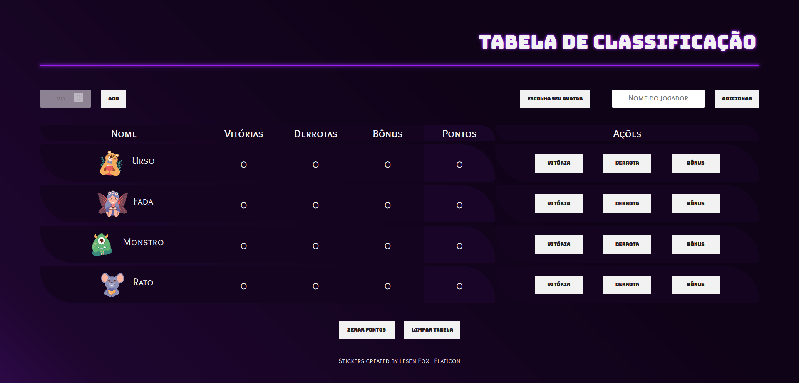

# Tabela de classificação

**Sexta aula da Imersão Dev_ Alura**

Criar uma tabela de classificação onde cada linha será um jogador, sendo que cada jogador representa um objeto dentro de uma array.   
Cada objeto jogador possui as seguintes propriedades: nome (composto por uma imagem de avatar mais o nome do jogador), vitórias, derrotas, bônus e pontos.

## Conteúdo da aula:

- Remover o código estático do HTML;
- Criar um objeto no Javascript para cada jogador;
- Criar uma função que receba um objeto como parâmetro para calcular os pontos;
- Exibir o objeto na página HTML;
- Criar uma função para adicionar vitória, outra para adicionar empate e uma última para adicionar derrota;
- Recalcular os pontos quando vitória ou empate for adicionado.

## Desafios propostos:

1. Criar um botão e inputs (campos de texto) para adicionar novos jogadores, com seus respectivos dados:
2. Adicionar a imagem de cada jogador:
    - No HTML adicionei um menu dropdown com inputs do tipo *radio* que tem como *label* stickers, que são opções de avatar para os jogadores escolherem quando adicionarem seus nomes à tabela.

3. Criar um botão para zerar todos os pontos:
    - Adicionei dois botões à página, o primeiro aciona a função que faz um loop na array de jogadores e atribui o valor zero às propriedades: vitórias, derrotas, bonus e pontos. O segundo botão remove todos os jogadores da array e remove todos elementos da tabela, exceto o cabeçalho. 

4. Fazer a lógica de quando houver um empate, obrigatoriamente deveria já ajustar como empate para os demais jogadores:
5. Validar se todos os pontos estão fazendo sentido, tanto o número de empates, quanto derrotas e vitórias com os demais jogadores (impossível haver mais vitórias que derrotas, por exemplo):
    - desafios 4 e 5 foram ajustados às regras de pontuação do jogo escolhido para basear a pontuação da tabela.

6. Utilizar seu jogo preferido para se basear na pontuação da sua tabela de classificação:
    - Para a pontuação segui as regras do jogo **Dixit**, um jogo de cartas, no qual o jogador da rodada, chamado narrador, escolhe uma de suas cartas e dá uma dica sobre ela, os demais jogadores escolhem uma de suas próprias cartas que seja parecida à dica dada pelo narrador. Depois as cartas escolhidas são embaralhadas e expostas aos jogadores, cada jogador vota na carta que acha que é do narrador. Se todos acertarem ou todos errarem qual é a carta do narrador, ele perde a rodada. Ou seja, o narrador precisa que no mínimo um, mas não todos os jogadores acertem a sua carta.
    - Se o narrador vencer, ele e os demais jogadores que acertaram qual era a carta do narrador ganham 3 pontos - botão de `Vitória`.
    - Se o narrador perder não ganha ponto e os demais jogadores ganham 2 pontos - botão de `Derrota`.
    - Se algum jogador, que não seja o narrador, ganhou algum voto na sua carta, ganha 1 ponto para cada voto que recebeu - botão de `Bônus`.

## Além dos desafios:

- Adicionei um campo opcional para adicionar o valor da pontuação máxima para finalizar o jogo, quando algum jogador alcançar a pontuação determinada o programa vai exibir quem é o vencedor. Caso nenhuma pontuação máxima seja adicionada, as pontuações poderão ser adicionadas indefinidamente.

------------
A Pen created on CodePen.io. Original URL: [https://codepen.io/mpoleto/pen/VwxmLLY](https://codepen.io/mpoleto/pen/VwxmLLY).

