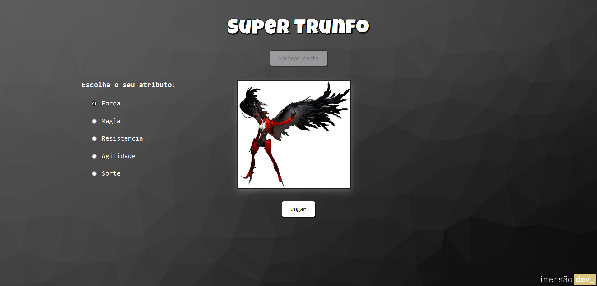

# Super Trunfo - Parte 1

**Sétima aula da Imersão Dev_ Alura**

Primeira parte da criação de uma página web do jogo *Super Trunfo*, a aula foi focada no desenvolvimento da lógica do jogo do zero, desde a criação das cartas, sorteio das cartas, interações com usuário, e definindo um vencedor.

## Conteúdo da aula:

- Adicionar a imagem do personagem e definir seus atributos;
- Desenvolver uma função para sortear uma carta para o jogador e outra para a máquina;
- Exibir os atributos das cartas na tela para o jogador;
- Obter o atributo escolhido pelo jogador e comparar com a carta da máquina;
- Comparar o atributo de ambas as cartas e definir um vencedor.

## Desafios propostos:

1. Verificar o que acontece caso você não selecione nenhum dos atributos e como solucionar:
    - Na função que compara o valor do atributo escolhido da carta do jogador com o da carta da máquina, adicionei uma condicional `if` para que se nenhum atributo tenha sido selecionado apareça uma mensagem dizendo que para selecionar um atributo.

2. Utilizar personagens que você gosta para criar as cartas e compartilhe com o pessoal lá na comunidade do Discord:
    - Utilizei os personas dos personagens principais do jogo Persona 5.

3. Adicionar a imagem do personagem assim que você selecionar a carta dele:
    - Quando o botão `Sortear carta` é clicado, além de sortear as cartas também chama a função que exibe na tela a imagem do personagem sorteado para a carta do jogador e as opções de atributo.  

----------
A Pen created on CodePen.io. Original URL: [https://codepen.io/mpoleto/pen/ZEoBOvb](https://codepen.io/mpoleto/pen/ZEoBOvb).

