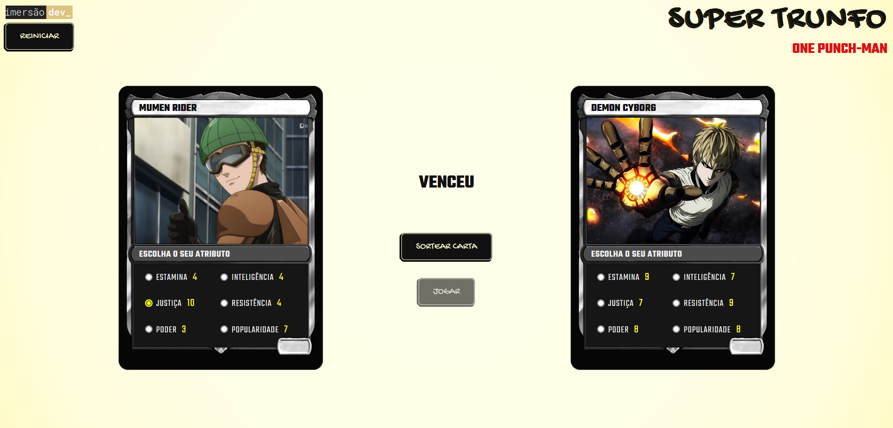

# Super Trunfo - Parte 2

**Oitava aula da Imersão Dev_ Alura**

Evolução da primeira parte do projeto *Super Trunfo*, focado em exibir as cartas na tela.

## Conteúdo da aula:

- Adicionar a moldura da carta;
- Criar uma função que exiba a carta da máquina;
- Além de exibir os atributos, exibir o valor de cada atributo.

## Desafios propostos:

1. Criar de fato um baralho, com várias outras cartas:
    - Criei um baralho (array de objetos) com diversos personagens do anime *One Punch Man*.
  
2. Desenvolver um sistema em que a cada carta que um jogador ganhe, ele fique com a carta do oponente e vice versa:
    - Escrevi a função `pegarCarta()` que tem um loop `for` para encontrar a posição dentro do baralho da carta que perdeu a rodada e usando o método `splice()` removê-la. Depois adiciona a carta removida ao baralho que venceu a rodada.  
  
3. Transformar as funções `exibirCartaMaquina()` e `exibirCartaJogador()` em apenas uma, chamada `exibirCarta()`, utilizando para isso a passagem de parâmetros.

## Além dos desafios:

- Escrevi uma função que dentro de um loop `for` sorteia uma carta do baralho e, dependendo do número do índice do loop, adiciona a carta sorteada no baralho do jogador ou no baralho da máquina. Dessa forma, os baralhos não são sempre os mesmos.
- Adicionei um botão de reiniciar para começar um novo jogo, seja no meio do jogo iniciado ou depois de finalizada a partida.
- Adicionei uma função que é acionada quando um dos baralhos fica sem carta. Criei uma estilização para quando o jogador ganha e outra para quando o jogador perde.

-----------------
A Pen created on CodePen.io. Original URL: [https://codepen.io/mpoleto/pen/YzLpmMb](https://codepen.io/mpoleto/pen/YzLpmMb).

